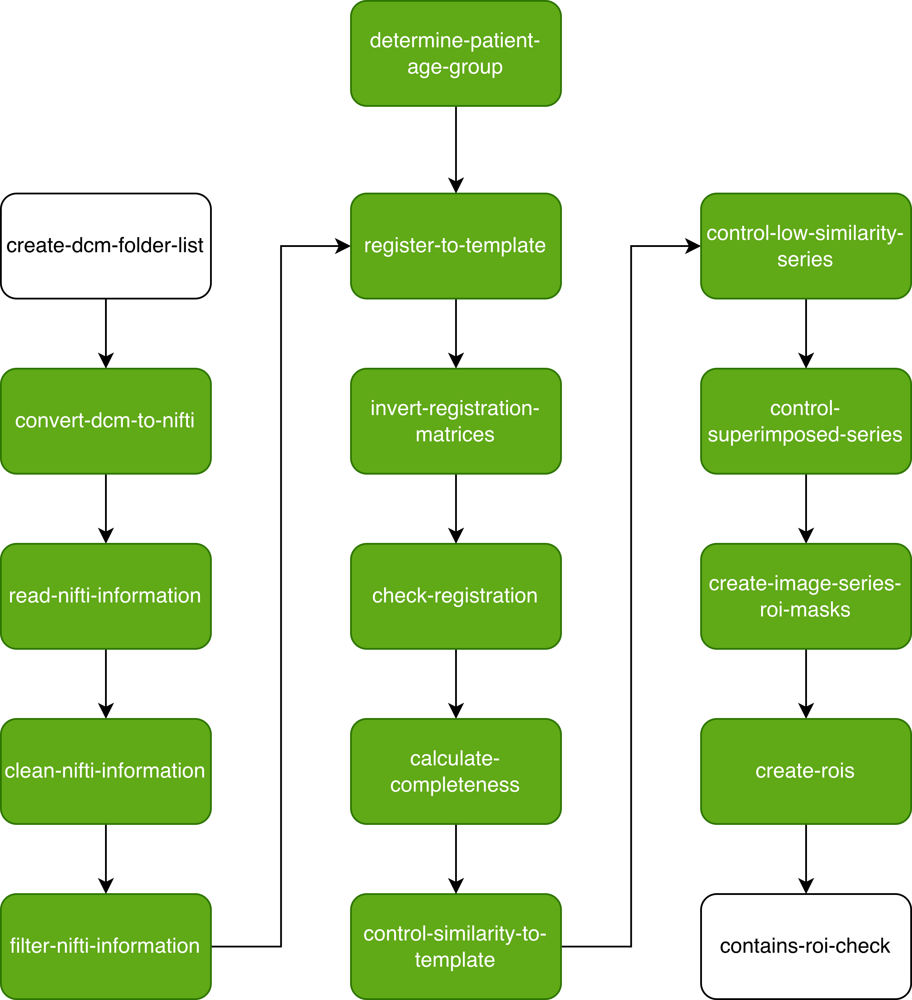

# ct-processing

A pipeline for preprocessing CT head image series. The pipeline was developed to extract regions of interest around
major intracranial arteries for subsequent image analysis. It should also work for extraction of different regions of
interest, provided the appropriate templates are available.

The pipeline includes (but is not limited to):
- DICOM to NIfTI conversion
- Extracting technical scanner parameters from the DICOM headers
- Co-registration to a template
- Quality control of the co-registration
- Determination of the part of the head which the CT scan covers (especially older CT scans can be divided into 
separate image series for the skull base and the skull vault)

## Installation

Apart from the dependencies listed in `requirements.txt`, parts of the code rely on:
* [FLIRT
(FMRIB's Linear Image Registration Tool)](https://fsl.fmrib.ox.ac.uk/fsl/docs/registration/flirt/index.html). In particular, we've used FLIRT 6.0 (other major versions may require adapting the calls to
FLIRT).
* [dcm2niix](https://github.com/rordenlab/dcm2niix) with version v1.0.20250506.

Example flow for setting up with a micromamba environment:
```bash
# Install micromamba
bash <(curl -L micro.mamba.pm/install.sh)

# Create micromamba environment
micromamba create -n ct-processing python=3.12
micromamba activate ct-processing

# Install additional dependencies
micromamba install -c conda-forge dcm2niix
micromamba install -c conda-forge -c https://fsl.fmrib.ox.ac.uk/fsldownloads/fslconda/public fsl-flirt

# Set output type for FLIRT registration
micromamba env config vars set FSLOUTPUTTYPE=NIFTI_GZ

# Install python dependencies
pip install -r requirements.txt
```

## Other Setup

You'll need to provide the following input in the base dataset folder:
```
/
├─ age_group_templates/
│  ├─ 0.nii.gz
│  ├─ 1.nii.gz
│  └─ 0_template_regions/
│     ├─ ROI_ICA_cavernous.nii.gz
│     └─ ROI_MCA_left.nii.gz
│     └─ ROI_MCA_right.nii.gz
│     └─ ROI_basilar.nii.gz
│     └─ ROI_vertebral.nii.gz
│  └─ 1_template_regions/
│     ├─ ROI_ICA_cavernous.nii.gz
│     └─ ROI_MCA_left.nii.gz
│     └─ ROI_MCA_right.nii.gz
│     └─ ROI_basilar.nii.gz
│     └─ ROI_vertebral.nii.gz
```
For our purpose we defined regions of interest on [these templates](https://doi.org/10.7488/ds/7763) to capture areas
around intracranial major arteries. Our regions of interest can be found [here](https://doi.org/10.7488/ds/7765).
The templates and regions can easily be exchanged for a different task. 

You will also need to subclass the src.datasets.structure.DatasetStructure to provide information about the dataset
structure. There are multiple examples in the file to help with this.

## Run the Tool

To execute the tool, run `python run.py [COMMAND] [OPTIONS]`. You can check out the available commands with
`python run.py --help` and see the required and optional arguments with `python run.py [COMMAND] --help`. An example
bash script to run the full pipeline (in a SLURM-managed environment) is provided in
`./example_execution/full_pipeline.sh`.

### Overview of the Pipeline




## Manual Intervention

While the tool can be configured to run in a fully automated fashion. We understand that manual intervention can be
necessary to establish trust in the dataset and to handle edge cases.

1. We visualize structural similarity (SSIM) between the CT image series and the respective template for subgroups of
the dataset as histograms. We also visualize the co-registered image series for the 5% lowest similarity scores to
enable inspection of potentially failed registrations. These files are created in
`./quality_control/similarity_information`. If the inspection reveals registration failures, these can be documented
in a `registration_failures.csv` in the same folder, and they will be excluded in the subsequent pipeline steps. For
convenience, the pipeline provides a `candidate_registration_failures.csv` that lists the image series with the 5%
lowest SSIM scores (which would be used to in the fully automated mode).

2. Additional visual inspection of superimposed registrations is possible using our
[CT Scan Superimposition Tool](https://github.com/bjin96/superimposition-tool). The resulting `blacklist.json` has to
be stored at `./quality_control/similarity_information` to be used in the subsequent pipeline steps.

## Pipeline Outputs
The final output of the pipeline are regions of interest from the input CT image series based on the template regions.
There are, however, intermediate outputs that provide information about the pipeline run. These can be found in:

```
/
├─ nifti_selection_files/
├─ quality_control/
```

## Acknowledgements & Citations
The work was funded by the UK Medical Research Council's Doctoral Training Programme in Precision Medicine
[MR/W006804/1].

If you use the pipeline, please cite:
```
@inbook{Jin_Valdés Hernández_Fontanella_Li_Platt_Armitage_Storkey_Wardlaw_Mair_2025,
    title={Pre-processing and Quality Control of Large Clinical CT Head Datasets for Intracranial Arterial Calcification Segmentation},
    DOI={10.1007/978-3-031-73748-0_8},
    booktitle={Data Engineering in Medical Imaging},
    publisher={Springer Nature Switzerland},
    author={Jin, Benjamin and Valdés Hernández, Maria Del C. and Fontanella, Alessandro and Li, Wenwen and Platt, Eleanor and Armitage, Paul and Storkey, Amos and Wardlaw, Joanna M. and Mair, Grant},
    editor={Bhattarai, Binod and Ali, Sharib and Rau, Anita and Caramalau, Razvan and Nguyen, Anh and Gyawali, Prashnna and Namburete, Ana and Stoyanov, Danail},
    year={2025}, 
}

```

The templates for the extraction regions of interest around major intracranial arteries are from:
```
@misc{Jin_Valdés Hernández_Mair_2024,
    title={Large intracranial artery regions in MRI head templates for calcium segmentation},
    rights={Creative Commons Attribution 4.0 International Public License},
    url={https://datashare.ed.ac.uk/handle/10283/8815},
    DOI={10.7488/DS/7765},
    publisher={University of Edinburgh. Brain Research Imaging Centre. Centre for Clinical Brain Sciences},
    author={Jin, Benjamin and Valdés Hernández, Maria Del C and Mair, Grant},
    year={2024}
}
```
```
@misc{Armitage_Chappell_MacLullich_Shenkin_Wardlaw_2024,
    title={Normal reference T1-weighted MR images for the brain at ages 65-70 and 75-80 years},
    rights={Creative Commons Attribution 4.0 International Public License},
    url={https://datashare.ed.ac.uk/handle/10283/8813},
    DOI={10.7488/DS/7763},
    publisher={University of Edinburgh. Brain Research Imaging Centre. Centre for Clinical Brain Sciences},
    author={Armitage, Paul and Chappell, Francesca and MacLullich, Alasdair and Shenkin, Susan and Wardlaw, Joanna M.},
    year={2024}
}
```
